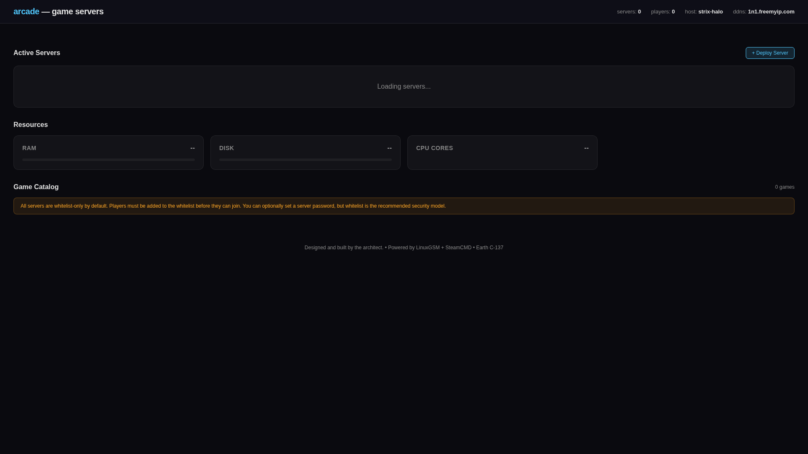
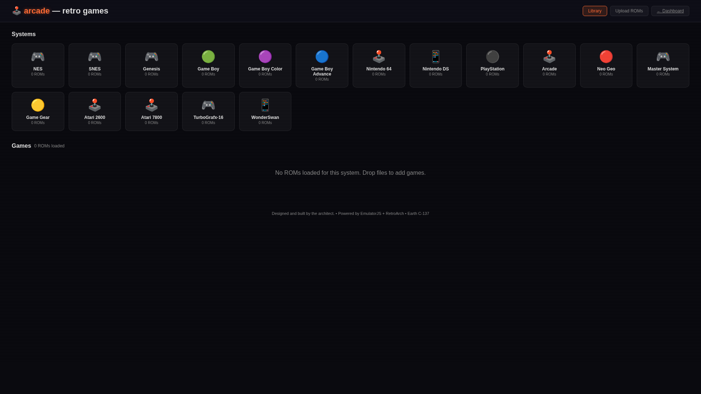
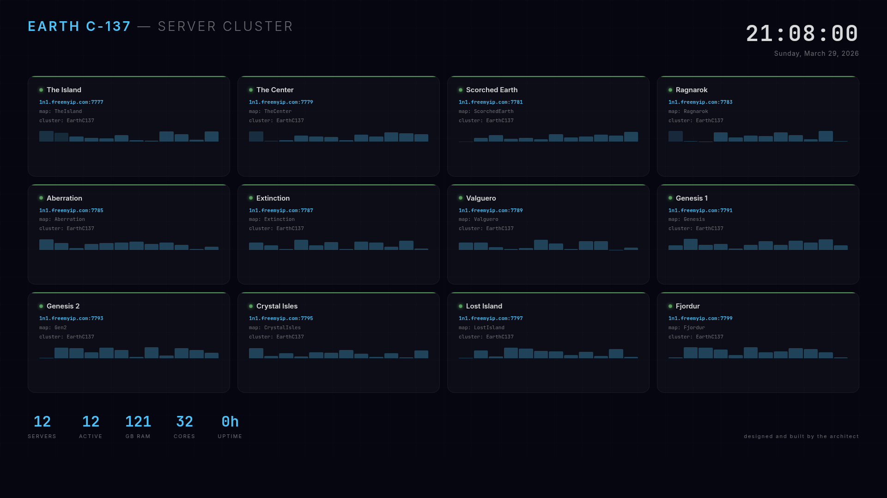
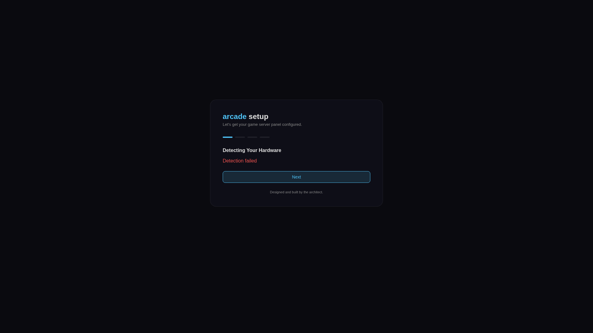

# Screenshots

> Designed and built by the architect.

| Arcade Dashboard | Retro Arcade |
|:---:|:---:|
|  |  |
| One-click game server deployment, 25 games | In-browser RetroArch, 17 systems, drop ROMs to play |

| Server Screensaver | Setup Wizard |
|:---:|:---:|
|  |  |
| Live cluster status, animated, KDE wallpaper plugin | Cosmos-inspired 4-step first-run config |
